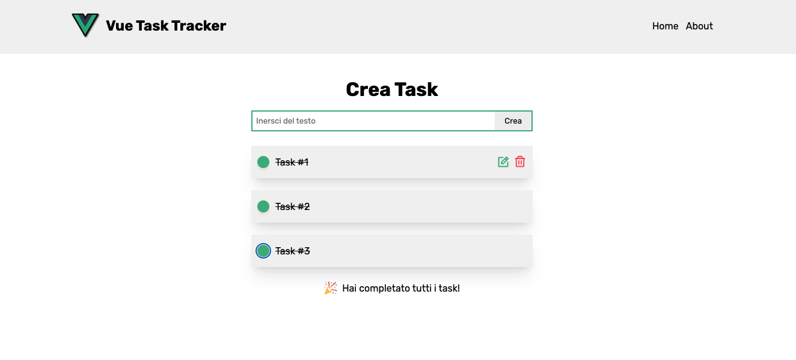

# Vue Task Tracker

SPA per per tener traccia dei propri task realizzata con VUE 3 (Composition API).
- CRUD - Creazione task, Lista dei task, Modifica Task ed Eliminazione task
- DB: localStorage
- Iconify per le icone (usando unplugin-icons per ottimizzazione)

## Development server

Da terminale dopo aver fatto `npm install` lancia `npm run dev`

## INFO
**Vue Task Tracker** è un piccolo applicativo fatto in Vue 3 (Composition API) praticamente con le stesse funzionalità di [Questo fatto in Angular 15](https://github.com/PierW/Angular-Task-Tracker), con salvataggio dei dati nel localStorage.
Vue 3 rimane il mio framework preferito. Angular ha senso utilizzarlo in altri contesti.
La stessa SPA fatta in Angular ha richiesto il doppio del tempo.
